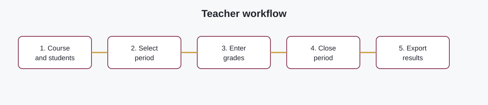

# NOTAZOD

> Desktop offline grade management for teachers.

NOTAZOD helps teachers manage courses, students, activities, periods, and grades without depending on an internet connection or a fragile spreadsheet full of formulas.

[](./design/README.md)
[](#installation)
[](#installation)
[](https://tauri.app/)


## What NOTAZOD does

- Manage multiple courses and student lists.
- Import students from CSV or HTML-table `.xls` files.
- Import data through a guided clipboard workflow: copy one Excel column, paste it, and continue.
- Create activities and enter a single Parcial grade per period.
- Configure the Activities/Parcial split automatically (for example, 40/60 or 30/70).
- Edit a grade directly from the table or from the student detail modal.
- Close and reopen periods manually.
- Calculate period grades, weighted accumulated grade, and final grade.
- Search students by name, code, or institutional email.
- Export selected table columns as PNG or download CSV/Excel-compatible templates.
- Keep all data locally in SQLite.

## Calculation model

### Grade inside a period

```text
Period grade = (Activities average × Activities %) + (Parcial × Parcial %)
```

The two percentages always add up to 100%.

### Course grade

```text
Period 1: 30%
Period 2: 35%
Period 3: 35%
```

`Acumulada` is the weighted contribution of closed periods. `Nota final` appears in Period 3 after all three periods are closed.

## Quick start for developers

```bash
cd /Users/zodiako/DEV/NOTAZOD/app
pnpm install
pnpm dev
```

Build the frontend:

```bash
pnpm build
```

Build the native macOS application:

```bash
DEVELOPER_DIR=/Applications/Xcode.app/Contents/Developer pnpm tauri build --bundles app
```

## Installation

For end users, see the complete guide:

➡️ **[Installation guide for macOS and Windows](docs/INSTALLATION.md)**

Release artifacts will be published through GitHub Releases:

- macOS Apple Silicon: `.dmg`
- Windows: `.msi` or `.exe`

## Screens and workflow

The main workflow is intentionally compact:

1. Create or open a course.
2. Select a period.
3. Search or filter students.
4. Enter grades from the main action menu or click a grade cell.
5. Close a period when grades are complete.
6. Export only the information needed.



## Technology

| Layer | Technology |
|---|---|
| Desktop shell | Tauri 2 + Rust |
| UI | React 19 + TypeScript |
| Components | Mantine |
| Build | Vite + pnpm |
| Persistence | SQLite through `tauri-plugin-sql` |
| Design | Token-based dark professional theme |

## Project structure

```text
NOTAZOD/
├── app/                 # Tauri + React application
│   ├── src/              # UI and client-side workflows
│   └── src-tauri/        # Rust/Tauri configuration and native shell
├── design/              # Product and design specification
├── docs/                # User and maintainer documentation
├── odd/tasks/           # Implementation records
├── prototype/           # Original reference prototype
└── tech-notes.md        # Confirmed technical decisions
```

## Data and privacy

NOTAZOD is offline-first. Course data is stored locally on the teacher's computer in SQLite. No account or online service is required for normal use. Back up the local application data before changing machines or reinstalling the operating system.

## Current scope: V1

V1 is frozen around the core teacher workflow: courses, students, guided clipboard import, activities, periods, calculations, editing, and exports. Future releases may add backup/restore, richer reports, signed installers, and automatic updates.

## License

License information will be added before the first public GitHub release.
